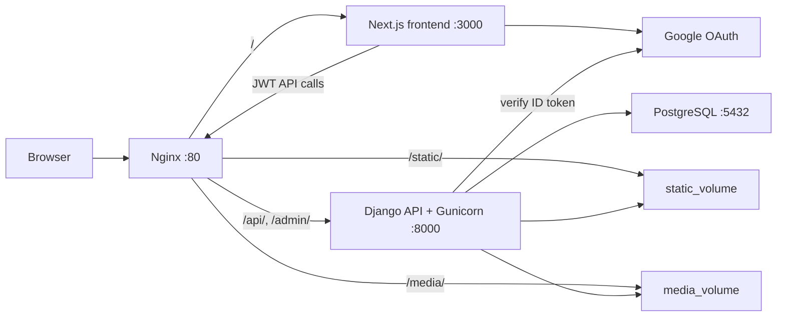

# Sessions Marketplace

A production-ready sessions marketplace where users can sign in with Google, browse creator-led sessions, book sessions, and manage dashboards. Creators can publish sessions, review bookings, and track statistics.

## Stack

| Layer | Technology |
| --- | --- |
| Frontend | Next.js 15, React 19, TypeScript, Tailwind CSS, Axios, React Hook Form |
| Backend | Django 5, Django REST Framework, SimpleJWT, django-filter |
| Auth | Google OAuth ID token verification, JWT access and refresh tokens |
| Database | PostgreSQL 16 |
| Runtime | Docker, Docker Compose, Gunicorn |
| Proxy | Nginx reverse proxy |

## Architecture



## Project Structure

```text
sessions-marketplace/
  backend/
    apps/
      bookings/
      dashboard/
      sessions_app/
      users/
    config/
    Dockerfile
    entrypoint.sh
    manage.py
    requirements.txt
  frontend/
    src/
      app/
      components/
      context/
      hooks/
      lib/
      services/
      types/
    Dockerfile
    package.json
    next.config.ts
    tailwind.config.ts
  nginx/
    nginx.conf
  docker-compose.yml
  .env.example
  README.md
```

## Features

- Google OAuth login with backend ID token verification.
- JWT access and refresh tokens with refresh and logout endpoints.
- Role-based access for `USER` and `CREATOR`.
- Public session catalog with pagination, search, filtering, and ordering.
- Creator session CRUD with image upload/removal support.
- Booking creation with duplicate booking protection and self-booking validation.
- User and creator dashboards with booking/session statistics.
- Responsive SaaS-style UI with protected and role-based routes.
- Production Docker setup with PostgreSQL, Django, Next.js, and Nginx.

## Environment Variables

Copy the root example file before running locally or with Docker:

```powershell
Copy-Item .env.example .env
```

| Variable | Used by | Required | Description |
| --- | --- | --- | --- |
| `SECRET_KEY` | Backend | Yes | Django secret key. Use a unique production value. |
| `DEBUG` | Backend | Yes | Set `False` for production. |
| `ALLOWED_HOSTS` | Backend | Yes | Comma-separated hostnames Django may serve. |
| `CORS_ALLOWED_ORIGINS` | Backend | Yes | Comma-separated frontend origins allowed by CORS. |
| `GUNICORN_WORKERS` | Backend | No | Gunicorn worker count. Default is `3`. |
| `POSTGRES_DB` | Database, backend | Yes | PostgreSQL database name. |
| `POSTGRES_USER` | Database, backend | Yes | PostgreSQL username. |
| `POSTGRES_PASSWORD` | Database, backend | Yes | PostgreSQL password. |
| `POSTGRES_HOST` | Backend | Yes | Database host. Use `db` in Docker. |
| `POSTGRES_PORT` | Backend | Yes | Database port. Use `5432` in Docker. |
| `GOOGLE_CLIENT_ID` | Backend | Yes | Google OAuth web client ID for token verification. |
| `NEXT_PUBLIC_API_URL` | Frontend | Yes | Public API base URL, for example `https://localhost/api`. |
| `NEXT_PUBLIC_GOOGLE_CLIENT_ID` | Frontend | Yes | Google OAuth web client ID for frontend login. |
| `NGINX_PORT` | Nginx | No | Host port mapped to Nginx. Default is `80`. |

`NEXT_PUBLIC_*` values are embedded when the frontend image is built. Rebuild the frontend image after changing them.

## Docker Setup

Docker is the recommended way to run the complete application.

1. Create `.env`:

```powershell
Copy-Item .env.example .env
```

2. Edit `.env` and set real values for `SECRET_KEY`, `POSTGRES_PASSWORD`, `GOOGLE_CLIENT_ID`, and `NEXT_PUBLIC_GOOGLE_CLIENT_ID`.

3. Build and start all services:

```powershell
docker compose up --build
```

4. Open the app:

```text
http://localhost

> **Note:** The app is configured to redirect HTTP to HTTPS. After startup, access via `https://localhost`. The first time you'll see a self-signed certificate warning — click **Advanced → Proceed to localhost**.

5. Useful Docker commands:

```powershell
docker compose ps
docker compose logs -f backend
docker compose logs -f frontend
docker compose logs -f nginx
docker compose down
```

The compose stack starts four services:

| Service | Purpose |
| --- | --- |
| `db` | PostgreSQL database with persistent `postgres_data` volume. |
| `backend` | Django API, migrations, static collection, and Gunicorn. |
| `frontend` | Next.js standalone production server. |
| `nginx` | Public reverse proxy on `NGINX_PORT`. |

Nginx routes:

| Path | Target |
| --- | --- |
| `/` | Next.js frontend |
| `/api/` | Django backend |
| `/admin/` | Django admin |
| `/static/` | Django static volume |
| `/media/` | Django media volume |
| `/healthz` | Nginx health check |

## Local Development

Local development outside Docker requires PostgreSQL and environment variables matching `.env.example`.

### Backend

```powershell
cd backend
python -m venv .venv
.\.venv\Scripts\Activate.ps1
pip install -r requirements.txt
python manage.py migrate
python manage.py runserver 0.0.0.0:8000
```

Backend local URL:

```text
http://localhost:8000
```

### Frontend

Create `frontend/.env.local`:

```powershell
Copy-Item frontend/.env.local.example frontend/.env.local
```

For local development against Django directly, use:

```text
NEXT_PUBLIC_API_URL=http://localhost:8000/api
NEXT_PUBLIC_GOOGLE_CLIENT_ID=replace-with-google-oauth-client-id.apps.googleusercontent.com
```

Start the frontend:

```powershell
cd frontend
npm install
npm run dev
```

Frontend local URL:

```text
http://localhost:3000
```

## Google OAuth Setup

1. Go to Google Cloud Console.
2. Create or select a project.
3. Configure the OAuth consent screen.
4. Create an OAuth 2.0 Client ID with application type `Web application`.
5. Add authorized JavaScript origins:

```text
http://localhost
http://localhost:3000
https://localhost
https://your-domain.com
```

6. Add authorized redirect URIs if your Google configuration requires them for the web client.
7. Put the client ID in both variables:

```text
GOOGLE_CLIENT_ID=your-client-id.apps.googleusercontent.com
NEXT_PUBLIC_GOOGLE_CLIENT_ID=your-client-id.apps.googleusercontent.com
```

The frontend receives the Google credential and sends it to `POST /api/auth/google/`. The backend verifies the ID token with Google, creates or updates the user, and returns JWT tokens.

## API Endpoints

Authentication uses the header:

```text
Authorization: Bearer <access_token>
```

### Auth

| Method | Endpoint | Auth | Description |
| --- | --- | --- | --- |
| `POST` | `/api/auth/google/` | Public | Exchange Google ID token for JWT tokens. |
| `POST` | `/api/auth/token/refresh/` | Public | Refresh an access token. |
| `POST` | `/api/auth/logout/` | User | Blacklist a refresh token. |
| `GET` | `/api/auth/me/` | User | Get current profile. |
| `PATCH` | `/api/auth/me/` | User | Update profile fields. |
| `PATCH` | `/api/auth/role/` | User | Upgrade role to `CREATOR`. |

Google login request:

```json
{
  "token": "google-id-token"
}
```

Google login response:

```json
{
  "access": "jwt-access-token",
  "refresh": "jwt-refresh-token",
  "user": {
    "id": "uuid",
    "email": "user@example.com",
    "name": "User Name",
    "avatar": "https://example.com/avatar.jpg",
    "role": "USER",
    "created_at": "2026-01-01T00:00:00Z"
  }
}
```

### Sessions

| Method | Endpoint | Auth | Description |
| --- | --- | --- | --- |
| `GET` | `/api/sessions/` | Public | List sessions with pagination. |
| `GET` | `/api/sessions/{id}/` | Public | Retrieve session details. |
| `POST` | `/api/sessions/` | Creator | Create a session. |
| `PUT` | `/api/sessions/{id}/` | Creator owner | Replace a session. |
| `PATCH` | `/api/sessions/{id}/` | Creator owner | Update a session. |
| `DELETE` | `/api/sessions/{id}/` | Creator owner | Delete a session. |
| `GET` | `/api/sessions/my/` | Creator | List own sessions. |
| `GET` | `/api/sessions/stats/` | Creator | Session and booking statistics. |
| `DELETE` | `/api/sessions/{id}/image/` | Creator owner | Remove session image. |

Supported list query parameters include:

```text
search=django
ordering=price
ordering=-created_at
min_price=10
max_price=100
min_duration=30
max_duration=120
creator=<creator_uuid>
page=1
page_size=12
```

### Bookings

| Method | Endpoint | Auth | Description |
| --- | --- | --- | --- |
| `POST` | `/api/bookings/` | User | Book a session. |
| `GET` | `/api/bookings/my/` | User | List current user's bookings. |
| `GET` | `/api/bookings/{id}/` | Owner or creator | Retrieve booking detail. |
| `PATCH` | `/api/bookings/{id}/cancel/` | Owner | Cancel a pending booking. |
| `GET` | `/api/bookings/creator/` | Creator | List bookings for creator sessions. |
| `GET` | `/api/bookings/creator/stats/` | Creator | Booking counts by status. |
| `PATCH` | `/api/bookings/{id}/status/` | Session creator | Confirm or cancel a booking. |

Booking request:

```json
{
  "session": "session-uuid"
}
```

Creator status update:

```json
{
  "status": "CONFIRMED"
}
```

### Dashboards

| Method | Endpoint | Auth | Description |
| --- | --- | --- | --- |
| `GET` | `/api/dashboard/user/` | User | Profile, active bookings, and past bookings. |
| `GET` | `/api/dashboard/creator/` | Creator | Sessions, booking overview, and statistics. |

## Frontend Routes

| Route | Description |
| --- | --- |
| `/` | SaaS landing and discovery entry point. |
| `/catalog` | Browse available sessions. |
| `/login` | Google OAuth login. |
| `/session/[id]` | Session detail and booking panel. |
| `/dashboard` | User dashboard. |
| `/creator` | Creator dashboard and session management. |

## Testing

Backend tests cover authentication, role handling, session CRUD, booking rules, dashboard APIs, and permissions.

Run tests in a backend environment with dependencies and PostgreSQL available:

```powershell
cd backend
python manage.py test
```

Run focused suites:

```powershell
python manage.py test apps.users
python manage.py test apps.sessions_app
python manage.py test apps.bookings
python manage.py test apps.dashboard
```

Frontend quality checks:

```powershell
cd frontend
npm run build
npm run lint
```

## Deployment Notes

1. Set `DEBUG=False`.
2. Use a strong `SECRET_KEY`.
3. Set `ALLOWED_HOSTS` to your production domain.
4. Set `CORS_ALLOWED_ORIGINS` to your public frontend origin.
5. Set `NEXT_PUBLIC_API_URL` to `https://your-domain.com/api`.
6. Configure `GOOGLE_CLIENT_ID` and `NEXT_PUBLIC_GOOGLE_CLIENT_ID` with the production OAuth client ID.
7. Rebuild images after changing frontend public environment variables.
8. Put TLS in front of Nginx with your load balancer, reverse proxy, or a certificate-managed Nginx layer.
9. Back up `postgres_data` regularly.
10. Keep `media_volume` backed up if users upload session images.

## Demo Flow

1. Open the app at `https://localhost`.
2. Sign in with Google.
3. Browse the session catalog.
4. Open a session detail page and book the session.
5. Visit `/dashboard` to view bookings.
6. Upgrade the account to creator from the role flow.
7. Visit `/creator`.
8. Create a session.
9. Use another account to book it.
10. Return as creator to confirm or cancel the booking.

## Troubleshooting

### `docker compose up --build` fails because environment variables are blank

Create `.env` from `.env.example` and fill the required values:

```powershell
Copy-Item .env.example .env
```

### Frontend still calls an old API URL

`NEXT_PUBLIC_API_URL` is baked into the frontend build. Rebuild after changing it:

```powershell
docker compose build frontend
docker compose up -d
```

### Google login fails

Check that:

- `GOOGLE_CLIENT_ID` and `NEXT_PUBLIC_GOOGLE_CLIENT_ID` match.
- The Google OAuth client is a web client.
- Your current origin is listed in authorized JavaScript origins.
- The backend container can reach Google's token verification service.

### API returns CORS errors

Add the browser origin to `CORS_ALLOWED_ORIGINS`. Examples:

```text
CORS_ALLOWED_ORIGINS=http://localhost,http://localhost:3000,https://your-domain.com
```

### Django returns `DisallowedHost`

Add the public hostname to `ALLOWED_HOSTS`:

```text
ALLOWED_HOSTS=localhost,127.0.0.1,your-domain.com
```

### Nginx is healthy but API calls fail

Check backend health and logs:

```powershell
docker compose ps
docker compose logs -f backend
```

### Static or media files do not load

Confirm the Nginx container has the shared volumes and that the backend entrypoint ran `collectstatic`:

```powershell
docker compose logs backend
docker compose exec nginx ls /app/static
docker compose exec nginx ls /app/media
```

## License

This project is provided for the Sessions Marketplace assignment.
